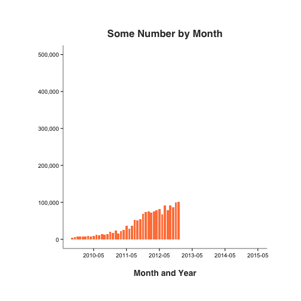

First Ever Shiny App
========================================================
author: Coursera Student XYZ
date: Jun 14, 2015
font-family: 'Helvetica'

App Overview
========================================================

**In this first Shiny app, you will see an interactive bar plot:**

- Displays monthly data of a quantity of interest
- Starting from year 2010
- Up to the year selected by the user

Use of Shiny Elements
========================================================

**This app uses a variety of Shiny capabilities:**

- *navbarPage* to organize app and documentation separately
- *tabPanel* to create two tabs for two navigational elements
- *slidebarLayout* to organize the content on each tab

**Additionally, following input and output elemts are used:**

- *selectInput* for a dropdown selection of year
- *renderPlot* to output a ggplot-based plot output

Data Overview and Summary
========================================================

* Time and numeric quantity data from a personal source.

* Data aggregated into a monthly value, and date is retained

* The following are some interesting things in the data:

 - Number of months: **69**
 - Highest monthly quantity: **465,061**
 - Highest month: **May 2015**

Visual Display
===

**The Shiny app uses a bar plot produced by ggplot2:**

- Shows monthly quantity value and growth
- Uses classic theme
- Renders a subset of the data based on user input

***

 
